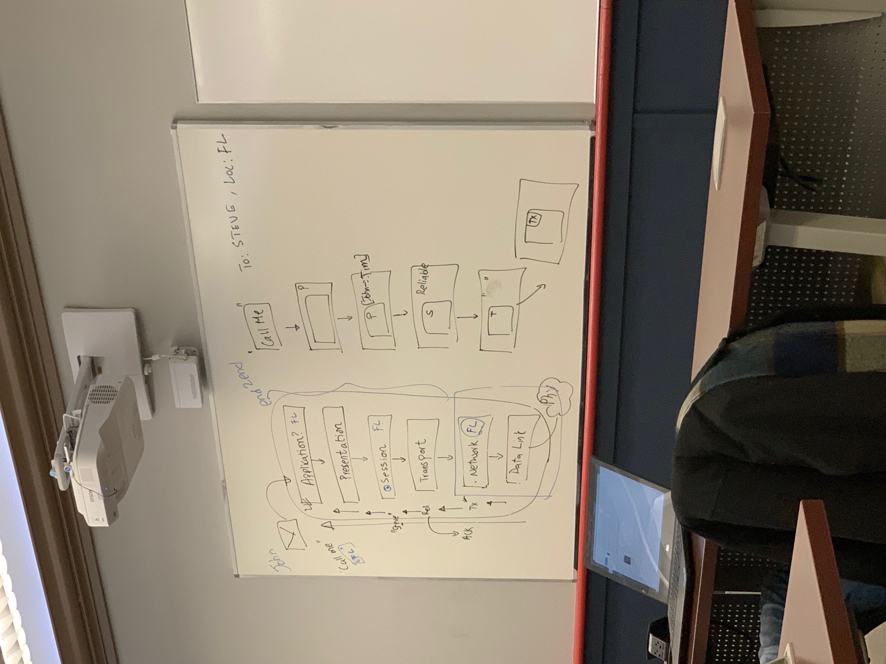
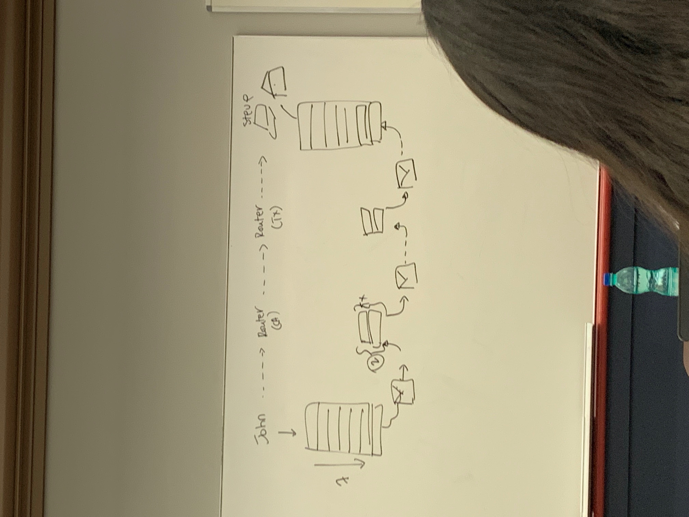
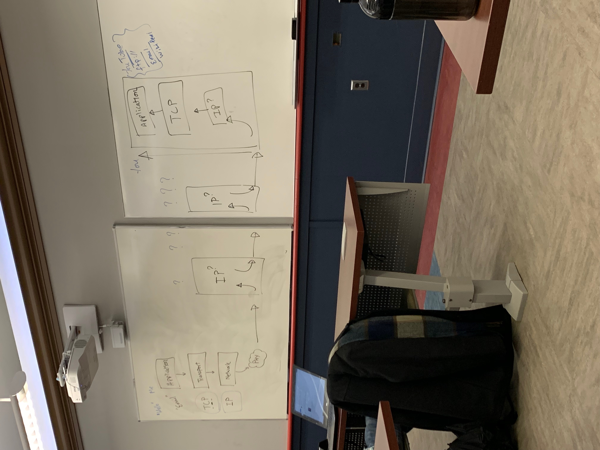

# Lecture 1

### Sending Packets Structure 

- Applications -> 
- Presentation -> 
- Session -> 
- Transportation -> 
- Network -> 
- Data Link -> 
- [Physical Medium]
    - All of these things reside on a single node. 
    - At every step, every message is put in a bigger envelope 
    - ***Only the applications are talking to another***

### Picture 

### REAL LIFE 

